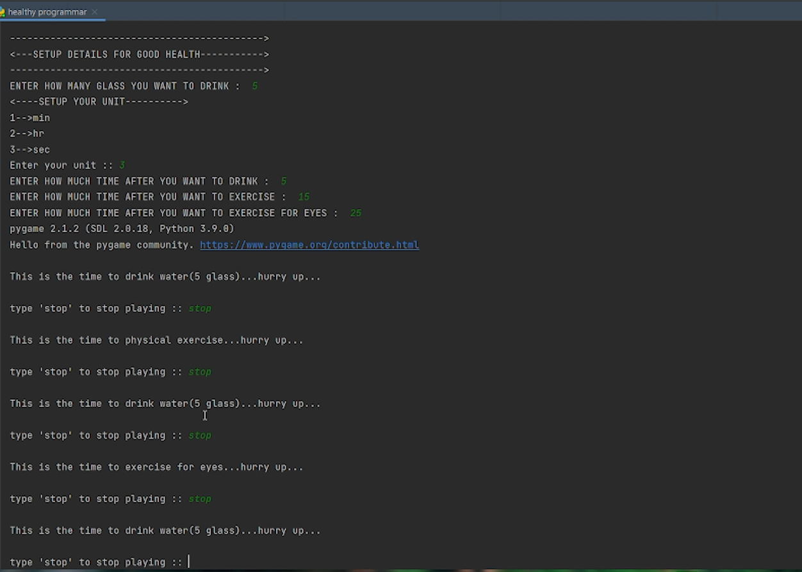
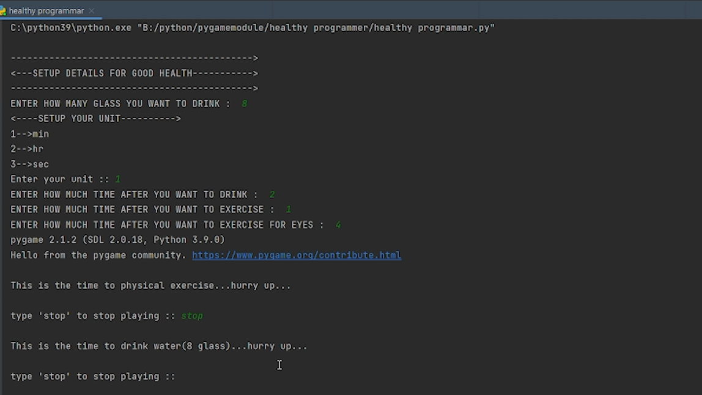
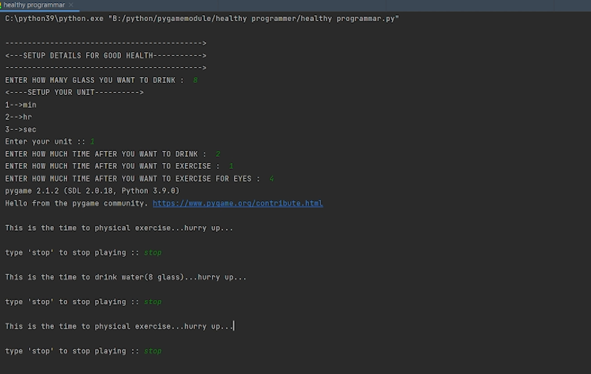

# HEALTHY-PROGRAMMAR  :star_struck: :open_mouth: :running: :star2:

[](https://shields.io/) [](https://shields.io/) [](https://shields.io/) [](https://shields.io/) 
<br>

***This new Healthy Programmar using Python is created by Biswarup Bhattacharjee, student of BTECH, in University of Engineering and Management, Kolkata.***

**Email Id: bbiswa471@gmail.com.** 

**Contact No: 916290272740.** 

<p align="left">
<a href="https://www.facebook.com/profile.php?id=100070395300810" target="blank"></a>
<a href="https://instagram.com/biswarup2210" target="blank"></a>
<a href="https://github.com/biswa2210" target="blank"></a>
</p>

## About :point_down: 

<div align="justified">
    
Healthy Programmar Application gives water, medicine and other health related reminders. We can set the things according to us. We can schedule time of eater, exercise etc. I have created this using Python.
 
</div>

## HEALTHY PROGRAMMER DEMO VIDEO: :point_right: <a href="https://www.youtube.com/watch?v=EkNDsq6XFkE&list=PL0lbDlMJ1h4ikgkbohDuJurlnFvGzJCMr&index=4">Click here to watch</a>

## PYTHON PLAYLIST: :point_right: <a href="https://www.youtube.com/watch?v=SsKXFCSfQgw&list=PL0lbDlMJ1h4ikgkbohDuJurlnFvGzJCMr">Click here to watch</a>

## Purpose :point_down:

<div align="justified">
    
I have made this so that it can give reminder to me and my friends for healthy life.

</div>


## Folder Structure :point_down:

```bash
HEALTHY PROGRAMMAR
    ├── drink water reminder.py
    └── healthy programmar.py
```
    
## Screenshots :point_down: 

<div align="center">
    
<a href="hp1.png"></a> 
    
<a href="hp2.png"></a>

<a href="hp3.png"></a>

</div>


